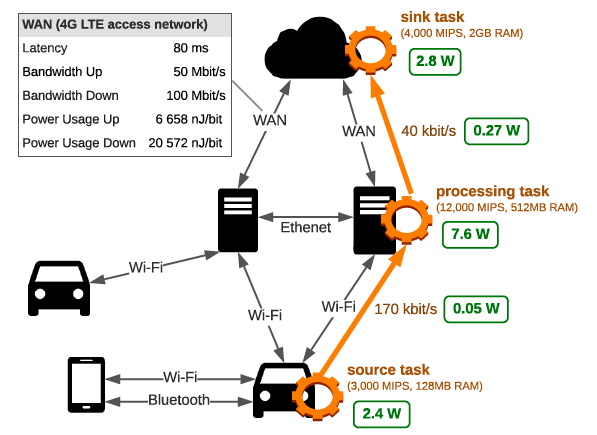
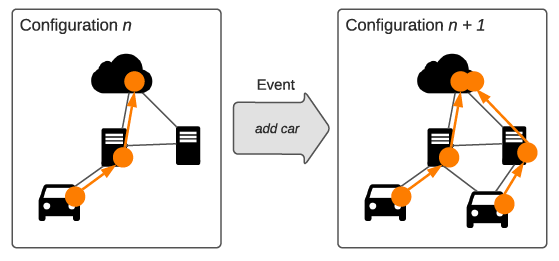

Welcome to LEAF
===============

What is LEAF?
-------------

LEAF is a simulator for **L**\ arge **E**\ nergy-**A**\ ware **F**\ og computing environments.
It enables then modeling of complex application graphs in distributed, heterogeneous, and resource-constrained infrastructures.
A special emphasis was put on the modeling of energy consumption (and soon carbon emissions).

.. image:: _static/infrastructure.png
    :alt: Alternative text

What can I do with it?
----------------------

LEAF enables a high-level modeling of cloud, fog and edge computing environments.
It builds on top of `networkx <https://networkx.org/>`_, a library for creating and manipulating complex networks,
and `SimPy <https://simpy.readthedocs.io/en/latest/>`_, a process-based discrete-event simulation framework.

Besides allowing research on scheduling and placement algorithms on resource-constrained environments,
LEAF puts a special focus on:

    - **Dynamic networks**: Simulate mobile nodes which can join or leave the network during the simulation.
    - **Power consumption modeling**: Model the power usage of individual compute nodes, network traffic and applications.
    - **Energy-aware algorithms**: Implement dynamically adapting task placement strategies, routing policies, and other energy-saving mechanisms.
    - **Scalability**: Model the execution of thousands of compute nodes and applications in magnitudes faster than real time.

How does it work?
-----------------

Unlike other discrete event simulators for computer networks, LEAF models infrastructure and applications on a high
level based on graphs. The infrastructure graph consists of compute nodes
such as data centers or sensors that are connected via network links. Applications are represented as
`directed acyclic graphs (DAG) <https://en.wikipedia.org/wiki/Directed_acyclic_graph>`_, where tasks are connected by their respective data flows.

This allows for easy to configure and easy to analyze experiments that are fast to execute.

The above example shows:

- an infrastructure graph with its resource constraints and power usage characteristics (black)
- a placed application with its resource requirements (orange)
- and its resulting power usage on the infrastructure (green)

In this configuration, the application’s combined power usage is 13.12 W.

How to model change over time?
..............................

The above example models the application's power usage at a specific point in time.
Now, in order to enable dynamically changing components such as mobile nodes, we can **update** the parameters, quantity and placement of infrastructure as well as applications through events:

Components can **read** from via events, too.
Examples for this are power meters that periodically measure the power usage of a component or placement strategies that change their behaviour based on certain system states.

LEAF allows you to model different kinds of algorithms, hardware (think of batteries that update their state of charge) and energy-saving mechanisms.
LEAF is *no* suitable tool if you require a low-level modeling of packet traffic for simulating effects like network congestion.

For a detailed explanation of the model, please read our paper [#leaf]_.

How do I use it?
----------------

To ease your start with LEAF, we provide some examples:

- The `simple scenario <https://github.com/dos-group/leaf/blob/main/leaf/examples/simple/main.py>`_ implements a data center,
  a fog node and a sensor that execute a simple application. Play around with the different parameters to see how resource constraints and task placement strategies affect the simulation.
- The `smart city traffic scenario <https://github.com/dos-group/leaf/blob/main/leaf/examples/simple/main.py>`_ is a lot more complicated.
  It simulates the traffic of taxis and the execution of two different kinds of applications in a connected city center.
  You can read up on the setup and results of this scenario in our paper.

Publications
------------

.. [#leaf] Philipp Wiesner and Lauritz Thamsen. "`LEAF: Simulating Large Energy-Aware Fog Computing Environments <https://ieeexplore.ieee.org/document/9458907>`_" In the Proceedings of the 2021 *5th IEEE International Conference on Fog and Edge Computing (ICFEC)*. IEEE. 2021. `[arXiv preprint] <https://arxiv.org/pdf/2103.01170.pdf>`_ `[video] <https://youtu.be/G70hudAhd5M>`_

.. toctree::
    :hidden:

    self
    changelog
    reference/modules

Contact
-------

LEAF was developed at the research group for `Adaptive Resource Management (ARM) <https://www.dos.tu-berlin.de/arm>`_, part of the research group for `Distributed and Operating Systems (DOS) <https://www.dos.tu-berlin.de>`_, at TU Berlin.

In case of questions, please reach out to `Philipp Wiesner <https://www.dos.tu-berlin.de/menue/people/wiesner_philipp/>`_.
