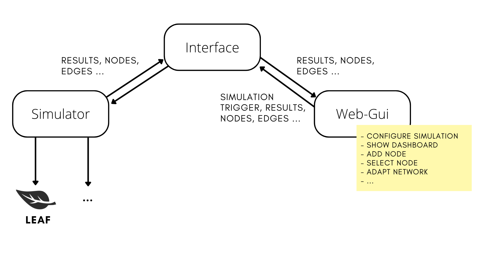

# Leaf GUI - 1.0.0

###Interactive user interface of energy consumption in edge and fog computing simulations

The following code presents a suitable graphical user interface (GUI) for the already implemented si-
mulator LEAF. The idea of the user interface is to provide an overview of the most important data, such as the energy consumption of the elements in the
network. The focus lies on the uncomplicated interaction between human and computers and also on providing a lot of data, clearly arranged and with an intuitive design. 

The Gui was implemented with [Dash](https://dash.plotly.com/cytoscape), which is a framework for rapidly building data apps in Python. 
Additionaly the [Dash Cytoscape](https://dash.plotly.com/cytoscape) component was used in order to provide an easily cutsomizable, web-based network graph.




# 🚀 Getting Started
### The following requirements should be installed:

````
dash==2.4.1,
dash-cytoscape==0.2.0,
dash-bootstrap-components==1.1.0,
plotly==5.8.0
````
### You can install the requirements with the following command in the root directory: 
```
$ python setup.py install
```

### The following necessary files for the simulation should be genarated:
````
config.json
infrastructure.json
link_measurements.csv
node_measurements.csv
````

<div style  = "background-color: #cfeaf7 ; padding:10px"> ❗ These can be generated by navigating to smart_city_traffic and running the main_vis.py.  </div>


### ▶️ Run the GUI via:

```
$ python app.py
```

### 💡 How to create Dash Callbacks:
Callbacks  in  Dash are functions that are automatically called by Dash whenever an input component's property changes, in order to update some property in another component (the output).

In order to create a callback,  Inputs and Outputs need to be implemented. The inputs and outputs of the application are described as the arguments of the @app.callback decorator and are simply the properties of a particular component.

Dash provides this callback function with the new value of the input property as its argument, and Dash updates the property of the output component with whatever was returned by the function.

<div style  = "background-color: #fff4c9 ; padding:10px">  ⚠️ Remember, that it is not possible to define the same  output value in different callbacks.  </div>


